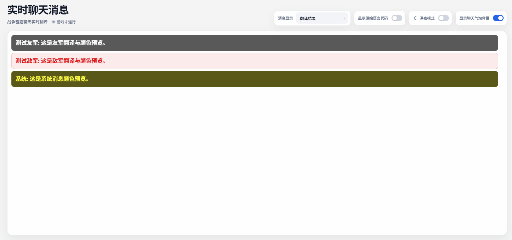
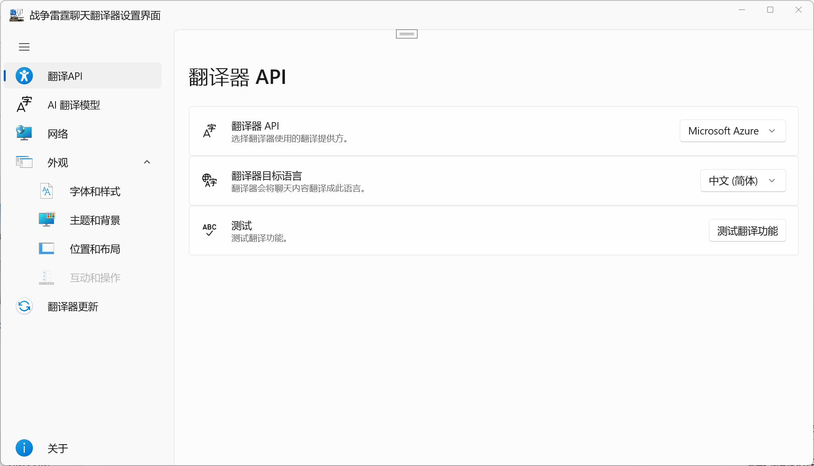
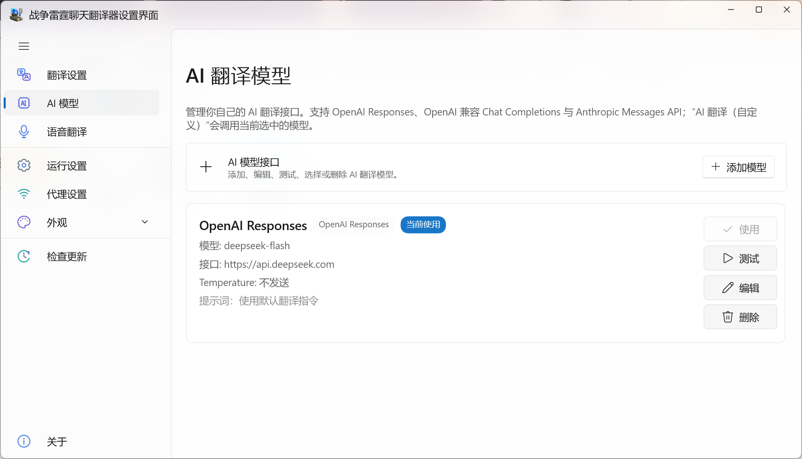
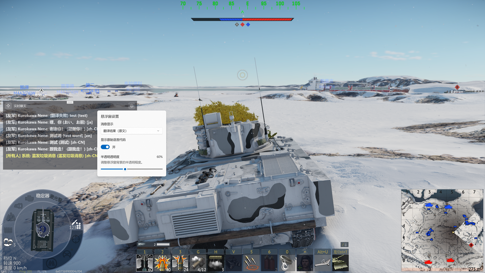

# WarThunderChatTranslator

打雷的时候看不懂对面在讲什么飞机？这里可以实时翻译聊天对话！目前支持 Yandex、微软、Google，以及用户自定义的 AI 翻译接口。

## 机翻生草机belike

悬浮窗可以通过点击托盘菜单的悬浮窗按钮开关，为了防止误触，悬浮窗的UI只有在焦点不在游戏内时才可交互！

## 快捷语音翻译

从 `互动和操作` 页面启用快捷语音翻译后，可通过系统级快捷键在 War Thunder 位于前台时直接录制一句语音。默认快捷键为：

- `Ctrl+Alt+1` → English
- `Ctrl+Alt+2` → Russian
- `Ctrl+Alt+3` → German
- `Ctrl+Alt+4` → Japanese
- `Ctrl+Alt+5` → Korean

第一次按快捷键开始 WASAPI 麦克风录音，再按一次同一快捷键立即结束录音。录音结束后才运行本地 `sherpa-onnx` Paraformer INT8 识别，因此游戏过程中不会持续执行 ASR 推理；识别得到的中/英文文本再通过当前选择的 GTranslate 翻译接口转换为该快捷键对应的目标语言，并自动写入 Windows 剪贴板。默认五组映射显示在可展开列表中，快捷键通过“录入 → 实际按组合键 → 完成”的方式绑定，并支持动态新增、删除和修改。

录音使用 NAudio 3 的 WASAPI 共享模式，可在设置页选择“系统默认”或任意具体麦克风/虚拟录音设备（例如 Soundpad/VB-Cable 暴露的 Capture endpoint），并显示实时输入电平。设备配置保存的是 Windows endpoint ID；所选设备失效时，设置页顶部会显示警告。麦克风权限仍由 Windows 管理，但本地 ASR **不再依赖 Windows 联机语音识别开关或 `Windows.Media.SpeechRecognition`**。

本地识别模型为 `sherpa-onnx-paraformer-zh-small-2024-03-09` 的 `model.int8.onnx`，支持中文和英文。模型加载后保持在内存中，解码默认只使用 1 个 CPU 线程；真正的模型推理只在录音结束后执行。源码包中的 `DownloadSpeechModel.ps1` 可下载并校验模型文件；发布/打包前模型应位于 `WarThunderChatTranslator/Assets/SpeechModels/sherpa-onnx-paraformer-zh-small-2024-03-09/`。

如果源码包中未直接包含约 81.8 MB 的 `model.int8.onnx`，双击仓库根目录的 `DownloadSpeechModel.cmd` 即可从官方模型源下载模型并校验 SHA-256；下载完成后项目文件会在 Build/Publish/MSIX 时自动把模型复制进输出。

录音开始、录音结束、翻译成功和翻译失败四类提示音均支持系统提示音、Windows TTS、自定义音频。录音开始时机可选择“提示音开始播放时立即录音”或“提示音播放结束后开始录音”，默认采用前者。TTS 可分别设置提示文本、系统已安装的 Microsoft 音色和语速，并按提示文本、音色与语速自动缓存；自定义音频支持 WAV、MP3、M4A、WMA。

`WarThunderChatTranslator.Tests/TestAudio` 中包含多段 **真实英文人声** PCM WAV，可直接导入 Soundpad 做端到端麦克风/虚拟设备测试。音频来自 pyannote.audio 随包提供的人类对话样本，并附上游 MIT License。模型存在时，测试项目还会使用这些音频执行 Paraformer 本地识别测试；模型缺失时该项测试标记为 Inconclusive。

## Todos

- [x] 重构至翻译界面WebUI
- [x] 支持目标语言切换
- [x] 提高代码复用性，减少重复
- [x] 实现网络代理设置
- [x] 实现游戏内覆盖
- [x] 实现 GPT / Claude 等 AI 翻译
- [x] 实现自定义 AI 翻译接口与模型管理
- [ ] 实现界面自定义
- [ ] 支持Bing Token
- [x] 支持全局快捷键语音识别、按快捷键选择目标语言并自动复制译文

## 更新记录

### v1.0.9.0

- 新增“互动和操作”设置页中的快捷语音翻译功能。
- 支持动态全局快捷键映射，快捷键通过实际按键捕获，不需要手工输入。
- 语音层改为 `NAudio.Wasapi` 自主录音 + `sherpa-onnx` Paraformer zh-en small INT8 本地识别，不再依赖 Windows 在线 `SpeechRecognizer`。
- 第一次按快捷键开始录音，第二次按同一快捷键立即停止；本地 ASR 仅在录音结束后推理，并默认使用 1 个 CPU 线程。
- 新增录音设备选择、刷新设备和输入电平显示，配置保存 Windows 音频 endpoint ID。
- 本地模型支持中文和英文；源码提供 `DownloadSpeechModel.ps1` 下载并校验模型。
- 新增录音开始、录音结束、翻译成功、翻译失败四组独立声音反馈；每组均支持系统提示音、Windows TTS、自定义音频。
- 保留“开始录音时机”设置：默认提示音开始播放时开始录音，也可等待提示音播放结束后再录音。
- TTS 支持独立提示文本、音色、语速及自动缓存。
- `WarThunderChatTranslator.Tests/TestAudio` 提供真实英文人声 Soundpad 测试 WAV，并增加可选的 Paraformer 识别测试。
- 包版本、程序集版本和文件版本统一为 `1.0.9.0`。

### v1.0.8.0

- 新增悬浮窗功能

### v1.0.7.0

- 新增“AI 翻译（自定义）”翻译方式。
- 新增 AI 翻译模型管理页，支持添加、编辑、测试、删除和切换模型。
- 支持 OpenAI Responses、OpenAI-compatible Chat Completions 与 Anthropic Messages 三种协议，可配置 Base URL、API Key、模型和自定义提示词。
- 增加 OpenAI Responses、OpenAI-compatible Chat Completions 与 Anthropic Messages 的 mock 单元测试。

### v1.0.6.0

- Dashboard 新增 War Thunder 游戏运行状态显示：状态点与运行/未运行文字常驻显示，悬停或键盘聚焦后通过浮层显示进程 PID 与启动时间。
- Dashboard 新增日间/深夜主题切换和“显示聊天气泡背景”选项。
- 修正游戏进程退出后 Dashboard 运行状态可能未及时清除的问题。

### v1.0.5.0

- 重构服务实现方式，大幅优化程序性能。
- 网页端聊天获取改为增量读取，并使用串行 `setTimeout` 调度，避免轮询请求重叠。
- 游戏轮询和网页轮询均新增独立设置项，默认均为 4 秒，可在设置页调整。
- 轮询间隔设置支持持久化保存，并同步补充对应 I18n 文案。

### WinUI XAML generated-code cache after upgrading

如果从旧源码目录覆盖升级后遇到 XAML 生成代码残留，请在 Visual Studio 中手动执行 Clean/Rebuild；项目文件不会自动删除 `obj` 中间文件。
