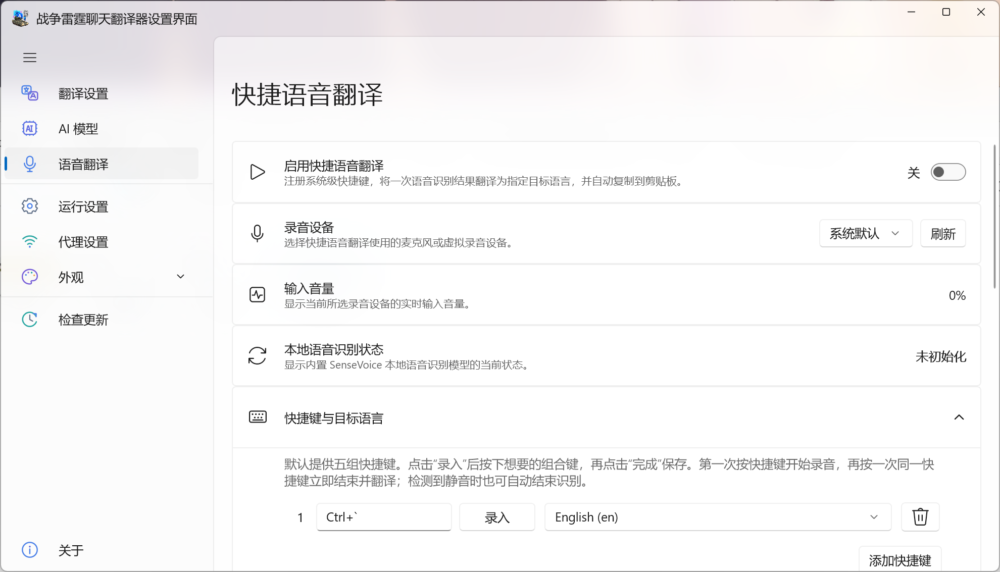
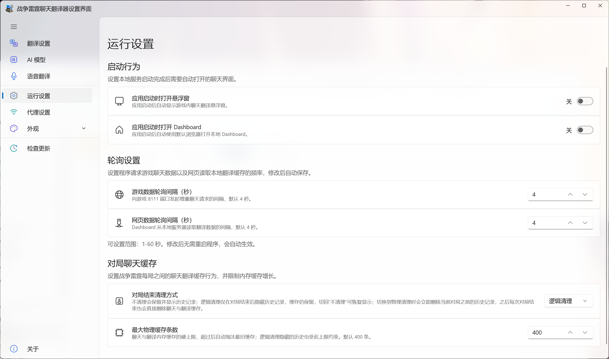
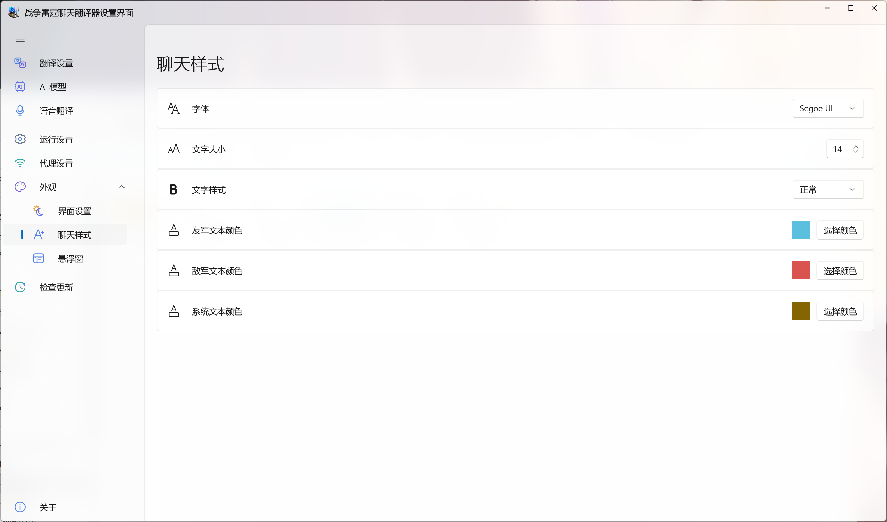
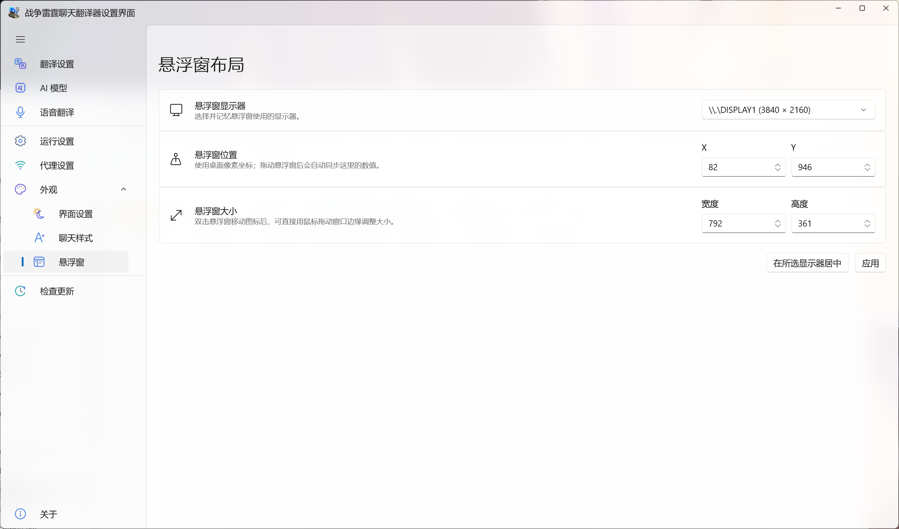

# WarThunderChatTranslator

打雷的时候看不懂对面在讲什么飞机？这里可以实时翻译聊天对话！这个项目从游戏本地接口读取聊天消息，翻译后显示在 Dashboard 或悬浮窗里；如果需要，也可以用快捷键将你说的话一键翻译成目标语言。

## 主要功能

- **实时聊天翻译**：持续读取 War Thunder 聊天消息，可显示译文、原文或两者同时显示，并支持来源语言提示。
- **多种翻译方式**：内置 Microsoft、Google、Yandex；也可以添加自己的 AI 服务，目前支持 OpenAI Responses、OpenAI-compatible Chat Completions 和 Anthropic Messages，并可单独配置模型、接口地址、Temperature 与提示词。
- **Dashboard 和游戏悬浮窗**：既可以在浏览器 Dashboard 里看，也可以直接把翻译窗口放到游戏画面上；悬浮窗支持显示器、位置、尺寸和透明度设置。
- **快捷语音翻译**：通过全局快捷键录音，本地使用 SenseVoice 做语音识别，再翻译到指定语言并自动复制结果。不同快捷键可以绑定不同目标语言，也能选择录音设备和提示音。
- **外观与运行设置**：可调整字体、字号、阵营文字颜色、聊天气泡、日间/深夜显示效果、轮询间隔和聊天缓存策略，并支持系统代理或自定义代理。

## 界面预览

<table>
  <tr>
    <td width="50%" align="center">
       
      实时聊天 Dashboard：把翻译后的队伍、敌方和系统消息集中显示。
    </td>
    <td width="50%" align="center">
       
      游戏内悬浮窗：不用切出去也能直接看聊天翻译。
    </td>
  </tr>
</table>

> 为了减少误触，游戏处于前台时悬浮窗只负责显示；需要拖动或调整时，先把焦点切出游戏。

<strong>查看更多设置界面</strong>

 
<table>
  <tr>
    <td width="50%" align="center"> 选择翻译服务和目标语言。</td>
    <td width="50%" align="center"> 管理自定义 AI 接口、模型与提示词。</td>
  </tr>
  <tr>
    <td width="50%" align="center"> 配置录音设备、快捷键和目标语言。</td>
    <td width="50%" align="center"> 启动、轮询与聊天缓存相关设置。</td>
  </tr>
  <tr>
    <td width="50%" align="center"> 字体、字号和不同消息类型的颜色。</td>
    <td width="50%" align="center"> 选择显示器并调整悬浮窗的位置和尺寸。</td>
  </tr>
</table>

## Todos

- [x] 重构至翻译界面 WebUI
- [x] 支持目标语言切换
- [x] 提高代码复用性，减少重复
- [x] 实现网络代理设置
- [x] 实现游戏内覆盖
- [x] 实现 GPT / Claude 等 AI 翻译
- [x] 实现自定义 AI 翻译接口与模型管理
- [x] 支持全局快捷键语音识别、按快捷键选择目标语言并自动复制译文
- [ ] 实现界面自定义

## 更新记录

### v1.1.0.0

- 优化界面布局

### v1.0.9.0

- 新增“互动和操作”设置页及快捷语音翻译能力。
- 新增动态全局快捷键映射与按键捕获配置。
- 新增录音设备选择、输入电平、本地模型状态与四类可配置声音反馈。

### v1.0.8.0

- 新增悬浮窗功能。

### v1.0.7.0

- 新增“AI 翻译（自定义）”翻译方式。
- 新增 AI 翻译模型管理页，支持添加、编辑、测试、删除和切换模型。
- 支持 OpenAI Responses、OpenAI-compatible Chat Completions 与 Anthropic Messages 三种协议，可配置 Base URL、API Key、模型和自定义提示词。

### v1.0.6.0

- Dashboard 新增 War Thunder 游戏运行状态显示：状态点与运行/未运行文字常驻显示，悬停或键盘聚焦后通过浮层显示进程 PID 与启动时间。
- Dashboard 新增日间/深夜主题切换和“显示聊天气泡背景”选项。
- 修正游戏进程退出后 Dashboard 运行状态可能未及时清除的问题。

### v1.0.5.0

- 重构服务实现方式，大幅优化程序性能。
- 网页端聊天获取改为增量读取，并使用串行 `setTimeout` 调度，避免轮询请求重叠。
- 游戏轮询和网页轮询均新增独立设置项，默认均为 4 秒，可在设置页调整。
- 轮询间隔设置支持持久化保存，并同步补充对应 I18n 文案。
