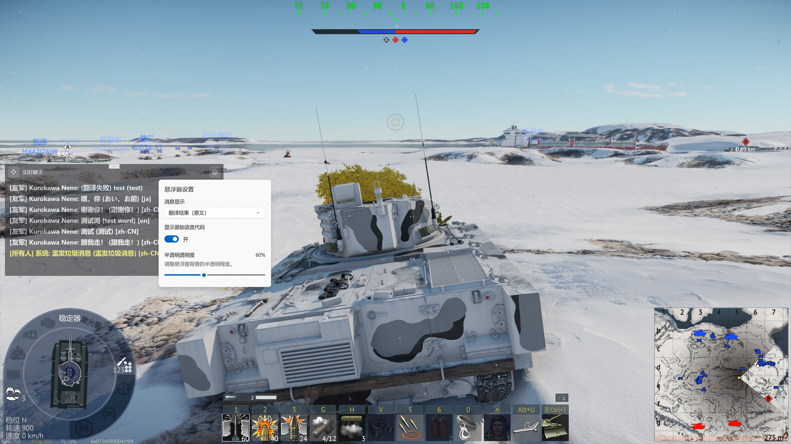
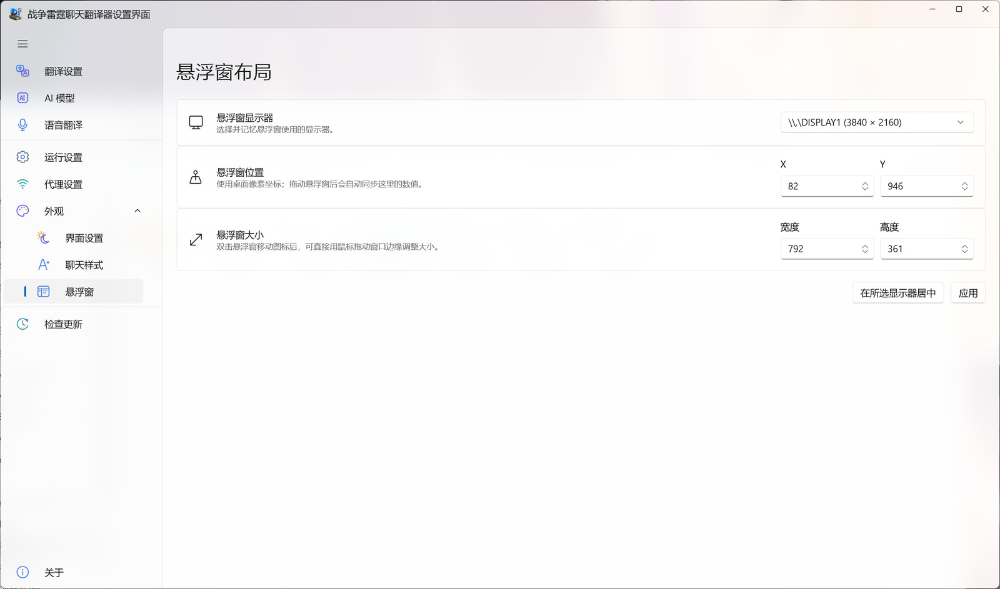

# In-Game Overlay

[⌂ Back to English guide](en-Home) · [Previous: Browser Dashboard](en-Dashboard) · [Next: Voice Translation](en-Voice)

> Show, hide, move, resize, and recover the in-game overlay.

---

## Show, hide, and restore

Select **Show/Hide Overlay** from the system tray. If the overlay is hidden, it appears; if already visible, the same menu item hides it.

You can also open the gear menu in the overlay's upper-right corner and choose **Hide Overlay**. This uses **the same hide behavior as clicking the tray item again**: the window is hidden without resetting its preferences. Select the tray item again to restore it.

## Gear menu options

| Option | What it does |
| --- | --- |
| **Message Display** | Choose translated text, original text, or both |
| **Show Source Language** | Show or hide the detected source-language label |
| **Overlay Opacity** | Make the overlay more or less transparent |
| **Hide Overlay** | Hide the overlay until you reopen it from the tray |

## Move or resize the overlay

1. **Switch focus away from the game** before interacting with the overlay.
2. Drag the overlay's **move handle** to reposition it.
3. Double-click the move handle to enter resize mode, drag an edge or corner, then double-click the handle again to leave resize mode.
4. Alternatively, open **Appearance → Overlay**, choose the display, adjust position and size, and select **Apply**.

## Why can't I click the overlay while playing?

To avoid interfering with controls, the overlay may not accept mouse clicks while War Thunder is the active window. Use **Alt + Tab** to switch away from the game before opening the gear menu, moving, or resizing the overlay.

## The overlay is missing or on the wrong monitor

Try showing it from the tray first. If it still cannot be found, open **Appearance → Overlay**, select the correct monitor, and choose **Center on Selected Display**. Apply any position or size changes before returning to the game.

> ➜ To show the overlay automatically at launch, see [Runtime Settings](en-Preferences).

---

[← Previous: Browser Dashboard](en-Dashboard) · [Back to English guide](en-Home) · [Next: Voice Translation →](en-Voice)
