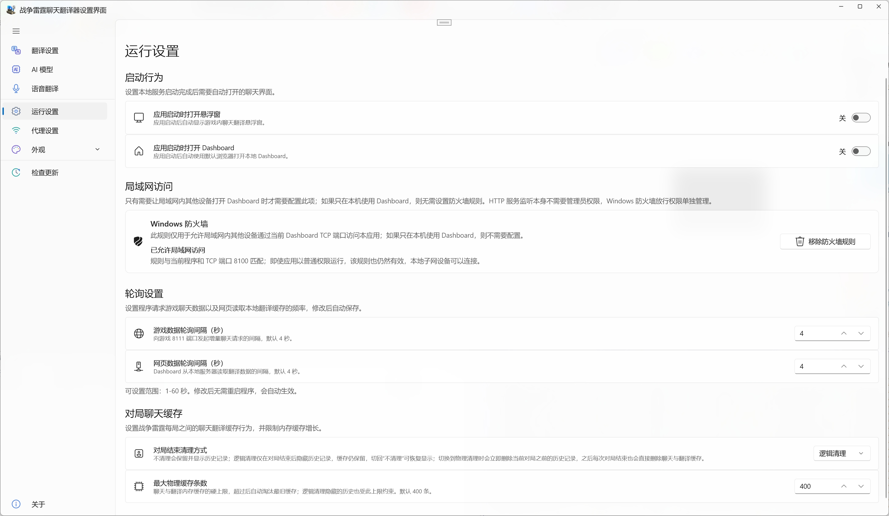

# Runtime & Network

[⌂ Back to English guide](en-Home) · [Previous: Content Filtering](en-Content-Filter) · [Next: Appearance & Language](en-Appearance)

> Manage startup behavior, LAN Dashboard access, Windows Firewall rules, polling intervals, and chat cache behavior.

---

## Startup behavior

Under **Runtime Settings**, choose whether the app should automatically open the **Overlay** and/or the **Dashboard** when it launches. If you prefer quiet background operation, leave the corresponding options off and open each view from the tray when needed.

## LAN access and Windows Firewall

WarThunderChatTranslator's local HTTP service listens on the LAN interface, and **the listener itself does not require administrator rights**. Whether a phone, tablet, or another computer can reach the Dashboard mainly depends on whether Windows Firewall has a valid allow rule.

If you **only use the Dashboard on this PC**, you do not need a firewall rule. A "not configured" status is therefore not an error by itself.

To allow another device on the local network to open the Dashboard:

1. Open **Runtime Settings → LAN Access**.
2. Check the **Windows Firewall** card.
3. Select **Allow LAN Access**. When the app is running without administrator rights, it first explains why elevation is needed and then requests Windows UAC confirmation.
4. After the rule is configured, Runtime Settings prefers the active interface with current traffic and external network access, and shows the Dashboard address plus a QR code for quick access from a phone or tablet.
5. Optionally enable **Access Authentication** for other LAN devices. It is off by default and uses a new random session token each time the app starts. Access from this PC is always exempt.

The app first checks whether Windows Firewall **already allows the current executable to receive the current Dashboard traffic in practice**. If you previously selected Allow access in the native Windows prompt, or an administrator / policy already created a sufficient inbound allow rule, that rule is accepted as-is and the app does not ask you to repair it again. Only when no usable allow rule exists does the app offer to create or repair one.

A rule created by WarThunderChatTranslator itself is restricted to the **current executable path + current TCP port + LocalSubnet + Private/Domain profiles**. It is not a broad port-only allowance for unrelated applications.

### Firewall status

| Status | Meaning / action |
| --- | --- |
| **LAN access allowed** | Windows currently has an effective inbound allow rule that covers this app, the current Dashboard TCP port, and the active network profile. The rule may have been created by WarThunderChatTranslator, by the native Windows Allow access prompt, or by an administrator; if it is already sufficient, no repair is requested. |
| **Firewall rule not configured** | No matching rule exists. Leave it this way if the Dashboard is only used locally; enable it only when another device needs access. |
| **Firewall rule needs an update** | A WarThunderChatTranslator rule exists, but its executable path, port, or other properties no longer match. Select **Repair Firewall Rule**. |
| **Local HTTP service is not running** | The Dashboard service did not start successfully. Restart the app or investigate the startup error first. |
| **Could not check firewall rule** | Windows Firewall state could not be read. Retry later or inspect the application log. |

### After a Microsoft Store update

A Microsoft Store update can change the versioned installation path. A rule with the correct display name may still point to the previous EXE path and therefore be ineffective.

The app first validates the **effective traffic coverage** for the current EXE, TCP port, direction, Allow state, and active network profile. Broader Windows-generated application rules (for example a current-program rule using Any protocol / Any port) are accepted when they already cover the Dashboard traffic. App-managed rule names and old paths are still tracked so a genuinely stale rule can be repaired when needed:

- On a standard-user launch, an outdated rule produces a notification without requesting UAC automatically. Clicking that notification opens the main window and takes you directly to **Runtime Settings → LAN Access**, where you can decide whether to repair it.
- If the app is already running as administrator and automatic firewall management has not been explicitly disabled, it can create or repair the rule automatically.
- A valid existing rule works for a standard-user process as well; the app does not need to run as administrator all the time.

### Removing the rule

When a managed rule exists, select **Remove Firewall Rule** to delete it. A standard-user process requests UAC only after you explicitly choose to remove the rule.

After a successful manual removal, the app remembers that choice and does not recreate the rule automatically on the next elevated launch. Selecting **Allow LAN Access** again restores the rule and automatic maintenance.

> The managed LAN rule currently applies to **Private / Domain** network profiles and **LocalSubnet**. If Windows classifies the current network as Public, another device may still be unable to connect.

## Message refresh settings

The **game chat refresh interval** and **Dashboard refresh interval** can be adjusted independently. The defaults work well for most users. Shorter intervals may make updates appear sooner; longer intervals reduce how often the app checks for changes.

## Chat history after a match

| Option | What to expect |
| --- | --- |
| **Keep History** | Previously shown messages can remain visible |
| **Logical Clear** | Starts the next match with a cleaner view; a good everyday choice |
| **Physical Clear** | Removes older messages more thoroughly; removed messages cannot be restored from the UI |

You can also adjust the chat cache size. The cache is not a permanent archive, so avoid options that permanently clear older entries if you want to revisit them.

## Network and proxy preferences

Open **Proxy Settings** and choose what fits your connection:

- **No Proxy:** a good starting point for an ordinary connection.
- **Use System Proxy:** follows your Windows proxy configuration.
- **Custom Proxy:** use only when you already have working proxy connection details.

After changing this setting, return to **Translation Settings → Test Translation** to confirm that translation still connects.

## Example setups

**Minimal in-game setup:** automatically open the overlay, but leave the browser Dashboard closed on launch.

**Second-screen / LAN device setup:** open the Dashboard and configure the firewall rule only if another device needs to reach it. No LAN firewall rule is needed when the Dashboard is used only in the local browser.

---

[← Previous: Content Filtering](en-Content-Filter) · [Back to English guide](en-Home) · [Next: Appearance & Language →](en-Appearance)
