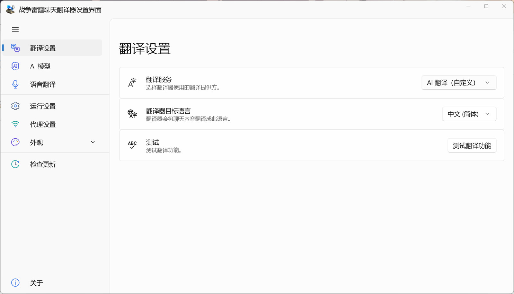

# Chat Translation

[⌂ Back to English guide](en-Home) · [Previous: Startup & System Tray](en-Tray) · [Next: AI Models](en-AI)

> Choose a translation provider and target language, then test them.

---

## Choose a translation service

Open **Translation Settings** in the app. You can choose one of the built-in services—**Microsoft Azure, Yandex, or Google**—or a separately configured **AI Translation** service.

| Your goal | Suggested action |
| --- | --- |
| First-time setup | Keep the default provider and test basic translation first |
| Compare translation results | Switch to another built-in provider and run the test again |
| Use your own AI service | Add and test it on the [AI Models](en-AI) page, then select AI Translation here |

## Select the chat target language

Choose the **target language** on the same page. This controls how new game chat messages are translated; it does not change the language of the app's menus. Available target languages can vary by provider, so try another service if your preferred language cannot be selected.

## Test before joining a match

1. Choose the provider and target language.
2. Select **Test Translation**.
3. Enter a short phrase in the dialog and confirm.
4. Check the result. If it fails, verify your connection, proxy preference, or AI configuration.

A successful test helps distinguish translation problems from periods when the game simply has no new messages.

## New messages are not appearing

- Make sure War Thunder is running, ideally during a match with new chat activity.
- Check that the Dashboard's **Message Display** setting includes translated text.
- Run a translation test again and verify the target language.
- You can adjust how often chat is refreshed under [Runtime Settings](en-Preferences). Translation may take a little time.

> 🔎 Game chat translation is for viewing incoming messages. To translate your own speech for chat, see [Voice Translation](en-Voice).

---

[← Previous: Startup & System Tray](en-Tray) · [Back to English guide](en-Home) · [Next: AI Models →](en-AI)
