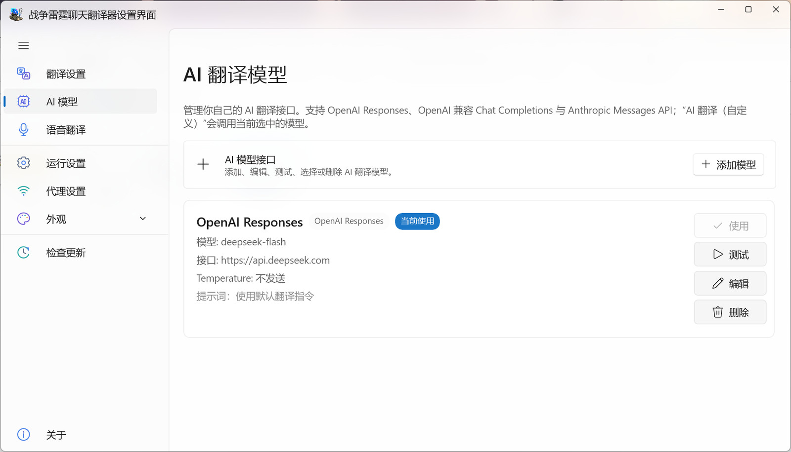

# AI 模型

[⌂ 返回简体中文目录](zh-Hans-Home) · [上一页: 聊天翻译](zh-Hans-Translation) · [下一页: 浏览器 Dashboard](zh-Hans-Dashboard)

> 添加、测试、使用和管理自定义 AI 翻译模型。

---

## 添加自己的 AI 翻译服务

1. 打开左侧的 **AI 模型**。
2. 点击 **添加模型**。
3. 按提供商说明选择服务类型，并填写**显示名称、服务地址、访问密钥（如需要）及模型名称**。
4. 如果你有特定翻译偏好，可在相应位置填写**自定义提示词**；其他高级选项初次使用时可以保持默认。
5. 点击 **保存** 返回模型列表。

这些信息通常由你选择的 AI 服务提供。若不清楚某项的含义，请先查看该服务的使用说明，不建议凭空填写。

## 测试、启用与切换

添加模型后还需要两步：

1. 在模型列表点击 **测试**，确认能够返回译文。
2. 点击该模型的 **使用**，然后返回 **翻译设置**，选择 **AI 翻译（自定义）**。

**只添加模型并不等于启用 AI 翻译。** 如果还在使用 Microsoft、Google 或 Yandex，聊天仍会走你当前选择的服务。

## 管理已有模型

| 操作 | 适用情况 |
| --- | --- |
| **使用** | 在多个已保存模型之间切换 |
| **测试** | 检查某个模型是否仍可连接 |
| **编辑** | 更换模型名称、密钥或翻译偏好 |
| **删除** | 不再需要某个模型时移除它；删除前留意确认提示 |

## AI 翻译不工作时

先检查模型是否通过测试、是否点击 **使用**，以及 **翻译设置**中是否真的选中了 AI 服务。若仍失败，检查服务账户是否有效、是否有使用额度，以及网络或代理设置。

> 🔐 不要在截图或公开求助信息中展示访问密钥。使用第三方翻译服务时，请留意对方的隐私和收费规则。

---

[← 上一页: 聊天翻译](zh-Hans-Translation) · [返回简体中文目录](zh-Hans-Home) · [下一页: 浏览器 Dashboard →](zh-Hans-Dashboard)
