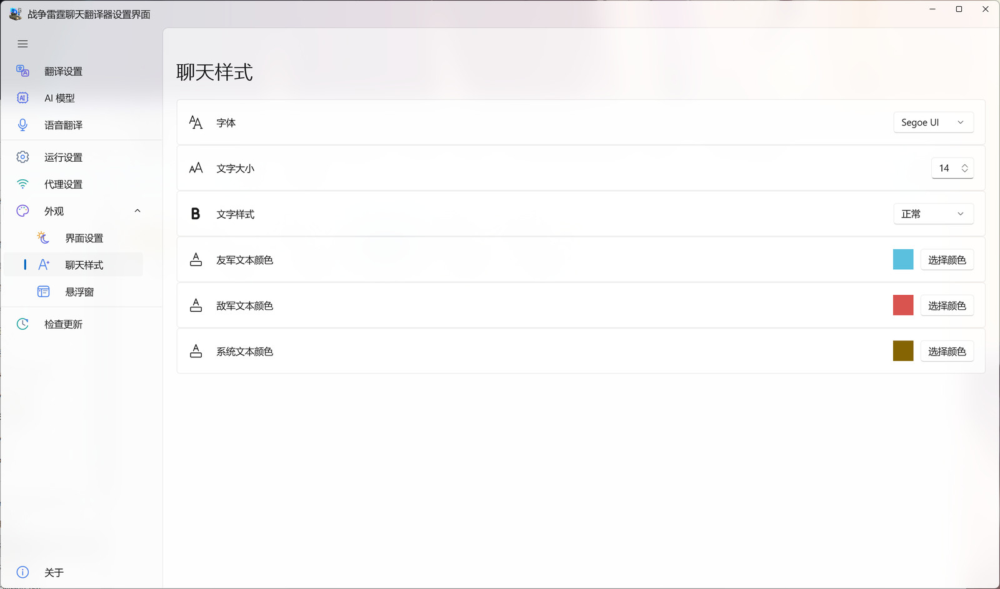

# 外观与界面语言

[⌂ 返回简体中文目录](zh-Hans-Home) · [上一页: 运行与网络设置](zh-Hans-Preferences) · [下一页: 更新与关于](zh-Hans-Updates)

> 界面语言、明暗主题、聊天字体和悬浮窗布局。

---

## 更改应用语言

打开 **外观 → 界面设置**，选择 **简体中文、繁体中文或 English**。手动选择后，应用会记住该偏好；以后启动不会因为 Windows 系统语言变化而自动覆盖。

如果从未手动选择，应用会根据 Windows 显示语言在这三种界面语言之间自动选择。其他暂不支持的系统语言会使用英文，并按提示告知你。**界面语言不决定聊天翻译的目标语言。**

## 更改明暗主题

在同一页选择 **浅色、深色或跟随系统**。想让应用与 Windows 颜色同步时请选择“跟随系统”。若个别窗口的文字没有立即刷新，可以关闭并重新打开设置窗口。

页面还有背景样式的进阶选项。如果你只是想调整聊天阅读体验，建议先使用主题及下面的聊天样式设置，无需修改进阶内容。

## 自定义聊天文字

进入 **外观 → 聊天样式**：

- **字体**：选择自己阅读舒服的字体。
- **字号和字重**：按显示器大小和观看距离调整。
- **友军、敌军、系统消息颜色**：分别设定，使不同消息更容易区分。

设置后，Dashboard 与悬浮窗会使用相应的聊天文字样式。不同设备已安装的字体可能不完全相同。

## 调整悬浮窗布局

在 **外观 → 悬浮窗** 可以选择显示器，并调整位置及尺寸；如果悬浮窗找不到，使用 **在所选显示器居中**。操作和鼠标穿透的说明请看[游戏悬浮窗](zh-Hans-Overlay)。

---

[← 上一页: 运行与网络设置](zh-Hans-Preferences) · [返回简体中文目录](zh-Hans-Home) · [下一页: 更新与关于 →](zh-Hans-Updates)
