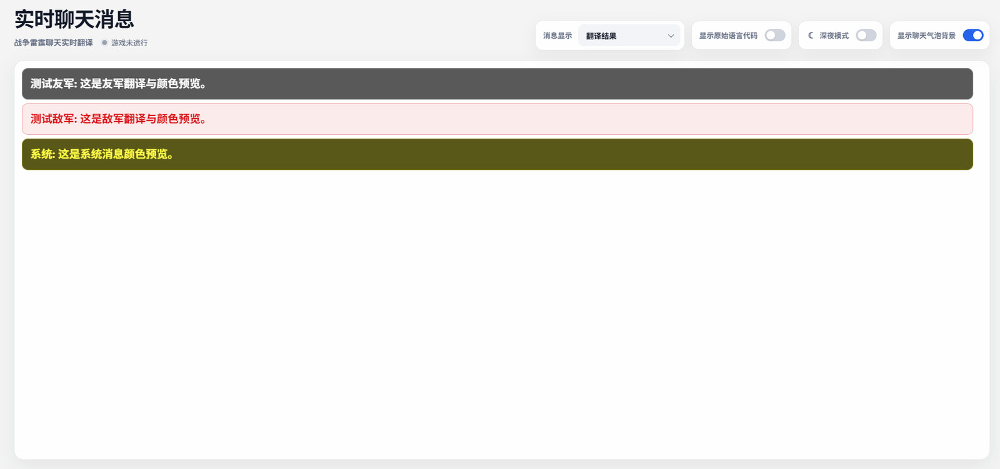

# 浏览器 Dashboard

[⌂ 返回简体中文目录](zh-Hans-Home) · [上一页: AI 模型](zh-Hans-AI) · [下一页: 游戏悬浮窗](zh-Hans-Overlay)

> 使用浏览器面板阅读游戏聊天与切换显示方式。

---

## 从哪里打开？

在 Windows 系统托盘中右键应用图标，选择 **面板**。程序会用默认浏览器打开 Dashboard。建议始终通过这个菜单进入，而不是把某个临时浏览器地址保存为固定书签。

如果希望每次启动程序时自动打开浏览器，可在 **运行设置** 中开启相应选项。

## 页面上可以调整什么？

| 控件 | 效果 |
| --- | --- |
| **消息显示** | 选择只看译文、只看原文，或译文与原文一起看 |
| **显示来源语言代码** | 控制是否显示识别到的原文语言标记 |
| **深夜模式** | 在明亮和较暗的浏览体验之间切换 |
| **显示聊天气泡背景** | 选择是否为每条消息显示背景 |
| **游戏运行状态** | 了解程序是否检测到正在运行的游戏 |

聊天消息还会按友军、敌军和系统消息使用不同的视觉样式；颜色与字体可以在[聊天样式](zh-Hans-Appearance)中调整。

## 从其他设备打开 Dashboard

如果要从同一局域网中的手机、平板或另一台电脑打开 Dashboard，请先到 **运行设置 → 局域网访问**检查 Windows 防火墙状态。只有跨设备访问才需要这条规则；如果 Dashboard 只在本机浏览器使用，则不需要配置。

配置后，请使用这台电脑的**局域网 IPv4 地址 + Dashboard 当前端口**访问。不要在其他设备上使用 `127.0.0.1` 或 `0.0.0.0`。

运行设置会自动优先选择**当前有流量且可以访问外部网络的网卡**，并直接生成二维码。手机或平板与电脑处于同一局域网时，可以直接扫码打开 Dashboard。

局域网认证是可选的，默认关闭。开启后，其他设备需要本次程序启动时随机生成的会话令牌；**本机访问始终免认证**，包括使用本机局域网 IP 打开 Dashboard。

详细说明见[运行与网络设置](zh-Hans-Preferences)。

## 为什么页面看起来没有变化？

如果游戏尚未运行、没有新聊天，或者翻译仍在进行，Dashboard 可能只显示等待内容。先确认游戏内确实出现了新聊天，再检查[翻译设置](zh-Hans-Translation)。

## 换浏览器后外观不一样？

部分网页显示偏好会由当前浏览器单独记住，所以换浏览器或清理浏览器数据后可能需要重新选择。浏览器里的显示选项与[悬浮窗](zh-Hans-Overlay)里的显示选项可以分别调整。

> 💡 想在游戏中直接查看同样的翻译消息？请使用[游戏悬浮窗](zh-Hans-Overlay)。

---

[← 上一页: AI 模型](zh-Hans-AI) · [返回简体中文目录](zh-Hans-Home) · [下一页: 游戏悬浮窗 →](zh-Hans-Overlay)
