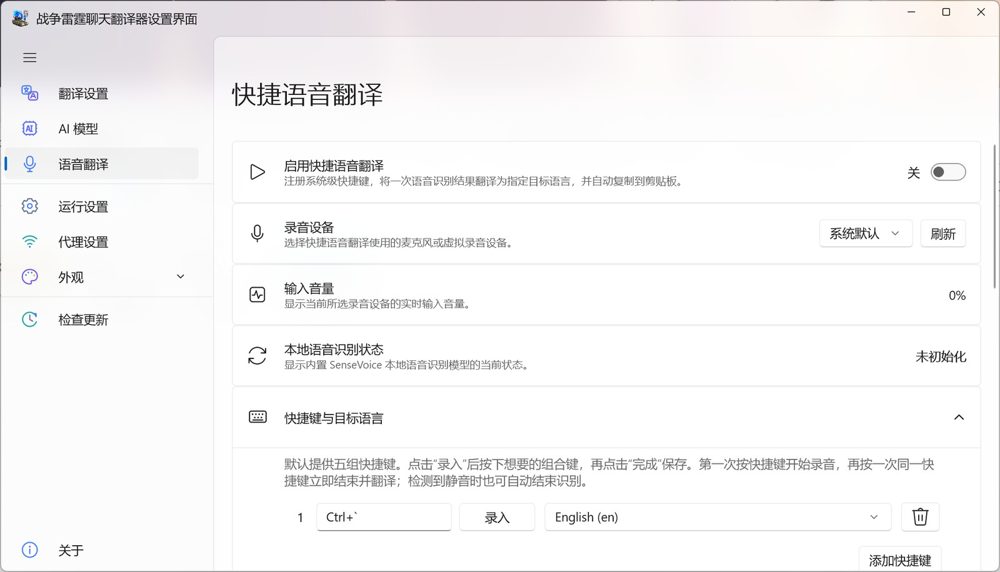

# 語音翻譯

[⌂ 返回繁體中文目錄](zh-Hant-Home) · [上一頁: 遊戲懸浮視窗](zh-Hant-Overlay) · [下一頁: 執行與網路設定](zh-Hant-Preferences)

> 設定麥克風、快捷鍵、錄音方式和提示音。

---

## 初次啟用

1. 開啟左側 **語音翻譯**。
2. 在**錄音裝置**中選擇系統預設麥克風或指定裝置；找不到裝置時按下 **重新整理**。
3. 試著說幾句話，觀察輸入音量是否有反應。如果頁面顯示麥克風不可用，請依提示檢查 Windows 麥克風權限。
4. 開啟 **啟用快捷語音翻譯**，檢查快捷鍵及對應的目標語言。

## 完成一次語音翻譯

1. 按一下目標語言對應的快捷鍵，**開始錄音**。
2. 說出想表達的內容。
3. **再次按同一組快捷鍵**，結束錄音。
4. 翻譯完成後，譯文會複製到剪貼簿；切回遊戲聊天框，**自行貼上並送出**。

錄音進行時，按下另一組語言快捷鍵不會切換目前的錄音。請先使用原本的快捷鍵結束。

## 預設快捷鍵

| 快捷鍵 | 翻譯成 |
| --- | --- |
| `Ctrl + Alt + 1` | 英文 |
| `Ctrl + Alt + 2` | 俄文 |
| `Ctrl + Alt + 3` | 德文 |
| `Ctrl + Alt + 4` | 日文 |
| `Ctrl + Alt + 5` | 韓文 |

如果與遊戲或其他軟體的按鍵衝突，可以重新錄入組合鍵。每個快捷鍵都能各自指定目標語言，也可以新增或刪除快捷鍵。

## 提示音與錄音體驗

錄音開始、錄音結束、翻譯成功及翻譯失敗，皆有獨立的提示音設定。可以選擇系統聲音、語音提示或自己的音訊檔案，並預覽播放效果。也能調整音量及開始錄音的時機。

## 遇到問題時

- **開關自行關閉**：查看頁面上的權限或裝置提示，重新選擇麥克風。
- **快捷鍵沒有反應**：確認功能已開啟，並排除與其他程式的按鍵衝突。
- **錄音成功但沒有譯文**：返回[翻譯設定](zh-Hant-Translation)先執行翻譯測試。
- **翻譯成功卻沒有送到遊戲**：程式只會複製譯文，不會自動替你送出聊天訊息。

> 💡 語音快捷鍵的目標語言，不會改變遊戲聊天的目標語言。

---

[← 上一頁: 遊戲懸浮視窗](zh-Hant-Overlay) · [返回繁體中文目錄](zh-Hant-Home) · [下一頁: 執行與網路設定 →](zh-Hant-Preferences)
